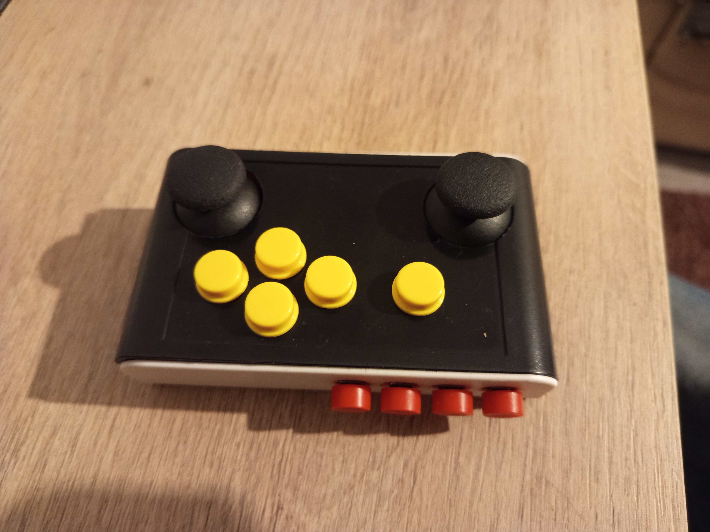
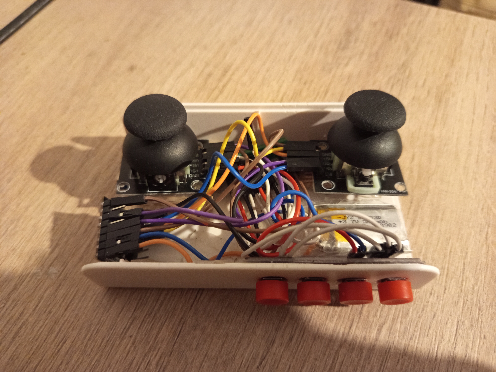
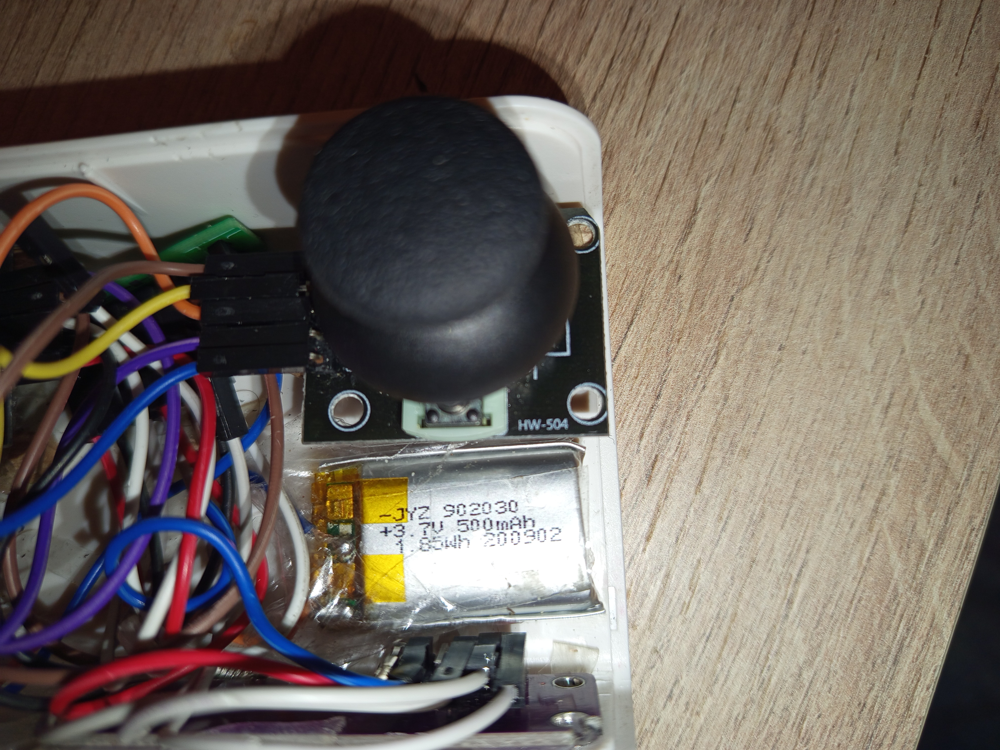
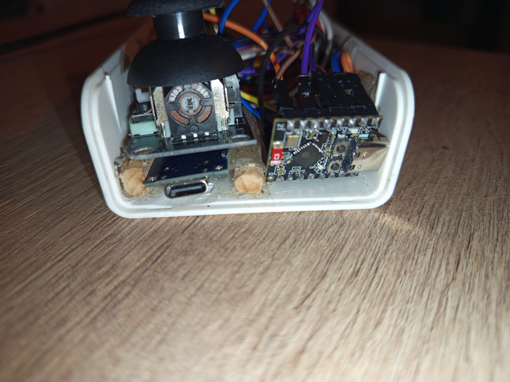

Csapat tagok:
|----|
| Baran Bence |
| Horváth Pál |
| Kozma Kristóf |

## Bluetooth játék kontroller
-egérmutató irányítása,kattintás

-billentyűzet gombok megnyomása

kompatibilis:
Windows,Mac,Android,Android Tv,

500 mah akkumulátor usb-c töltés(rövidzárlat,túl- és alul- töltési védelem)

Parts:
|----|
| https://www.aliexpress.com/item/1005002903684953.html |
| https://www.aliexpress.com/item/1005007101378960.html |
| https://www.aliexpress.com/item/4000873858801.html |
| https://www.aliexpress.com/item/1005007068603893.html |
| https://www.aliexpress.com/item/1005006043031985.html |
| https://www.aliexpress.com/item/1005010208376677.html |
| https://www.aliexpress.com/item/1005006689695078.html |
| https://www.aliexpress.com/item/32826552478.html |

| GPIO   | Function                         | Type |
|--------|----------------------------------|------|
| GPIO0  | Joystick A X-axis                | ADC  |
| GPIO1  | Joystick A Y-axis                | ADC  |
| GPIO2  | Joystick B X-axis                | ADC  |
| GPIO3  | Joystick B Y-axis                | ADC  |
| GPIO4  | Joystick A button                | Digital |
| GPIO5  | Joystick B button                | Digital |
| GPIO7  | Button 1                         | Digital |
| GPIO8  | Button 2                         | Digital |
| GPIO9  | Button 3                         | Digital |
| GPIO10 | Analog button array              | ADC  |
| GPIO20 | Button 4                         | Digital |

Arduino IDE használatával

### Képgaléria

| | |
| :---: | :---: |
|  |  |
|  |  |
